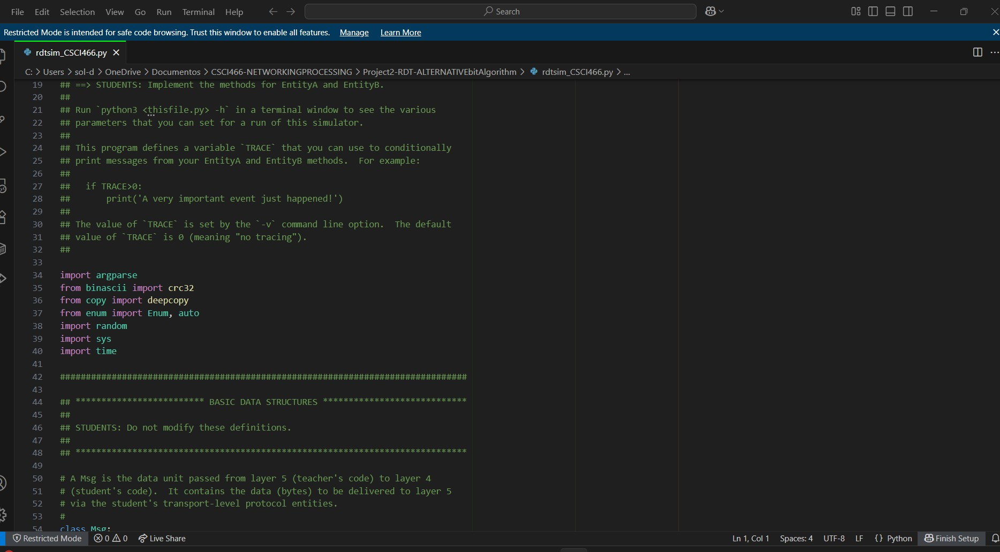

# Reliable Data Transfer (RDT) Protocol Simulator

## Description
This project is a Python implementation of the Alternating Bit Protocol (rdt3.0), a simple stop-and-wait transport protocol that ensures reliable data transfer over an unreliable network. It was developed as part of a networking lab assignment inspired by Computer Networking: A Top-Down Approach by Kurose & Ross.
The simulator emulates network conditions such as packet loss, corruption, and delay, allowing testing of transport-layer reliability features like acknowledgments, checksums, retransmissions, and sequence numbers.

## Features

#### EntityA (Sender):  
- Constructs packets with sequence numbers and checksums.
- Sends packets to the receiver and waits for ACK/NACK.
- Uses timers and retransmissions to recover from lost/corrupted packets.

#### EntityB (Receiver):
- Verifies packet integrity with checksums.
- Delivers valid messages to the upper layer.
- Sends back ACKs for correct packets and NACKs for errors.

#### Simulated Network Environment:
- Configurable packet loss and corruption probabilities.
- Message interarrival times and random seeds.
- Outputs statistics on throughput, losses, and corruption.

## Skills Demonstrated
- **Networking**: TCP/IP fundamentals, transport-layer reliability, flow control
- **Programming**: Python, object-oriented design, error handling
- **Protocols**: Alternating Bit Protocol (rdt3.0), ACK/NACK handling
- **Testing & Debugging**: Simulating packet loss, corruption, and delays

## Usage

- **Run the simulator with configurable parameters**:
python3 rdtsim_CSCI466.py -n 10 -d 100 -z 16 -l 0.1 -c 0.3 -v 2

-**n**: number of messages
-**d**: avg interarrival time between messages
-**z**: sequence number limit
-**l**: packet loss probability (0.0 – 1.0)
-**c**: packet corruption probability (0.0 – 1.0)
-**v**: tracing level (0 = silent, 2 = debug output)

## Example Simulation Output
- Packets lost, retransmitted, or corrupted
- Valid ACK/NACK exchanges
- Final throughput statistics

## References
Kurose, J.F., & Ross, K.W. Computer Networking: A Top-Down Approach
Course: CSCI 466 - Computer Networking

Kurose, J.F., & Ross, K.W. Computer Networking: A Top-Down Approach

Course: CSCI 466 – Computer Networking
